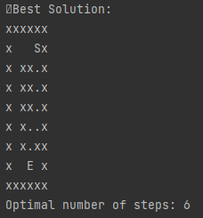

# Labyrinth-Project
Basic template to write the program that solves a labyrinth

In this project you will find the instructions and some basic code to start working.

## Deliverables

- **Pseudocode**(40%): Write in a PDF document the algorithm for this project. Make sure you make it unambiguous and don't skip any step in the process.
- **FlowChart**(30%): Make a diagram (with whatever tool you want, you could use [DrawIO](https://app.diagrams.net), paint, canva, etc.) that represents the pseudocode.
- **Code**(30%): Write the code in Python and upload the .py file.

## Problem to solve

Find the BEST route to solve a labyrinth made of characters as a matrix. This route should be the one that requires the least amount of steps.

Consider the following conditions: 

- The character `'x'` represents a wall.
- Assume the labyrinth's borders are made of walls. 
- The route begins in the character `'E'` and ends in the character `'S'`.
- If there is more than one path to take, we start checking the one to the left.
- We move by changing a free space (`' '`) with a dot (`'.'`).
- Each time we take a step, we must repeat the process of checking available paths in every direction AND add 1 to the number of steps.
- Each time we have more than one path we must save that position (create a checkpoint there).
- When reaching a Dead End, return to the last saved position.
- When standing next to an exit `'S'` save the path and check if it is the optimum solution by comparing the number of steps.
- Repeat the labyrinth until all paths have been tested.

This is an example of the output we want:

